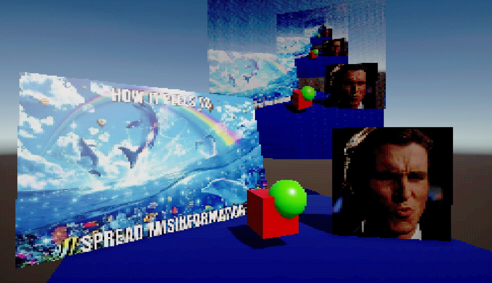

# Unity retro effect

A simple project with a post-processing shader which adds

- limited color palette
- dithering
- pixelation

## How to use

To change the settings for the retro shader, open `Assets/Materials/RetroEffect.mat` in the inspector.

## Parameters

`ColorsPerChannel` is the number of possible values per channel. The larger this value is, the more smooth color gradients will be. The default is 16.

`DitherAmount` is the intensity of the dither effect. The default is 0.1.

`PixelationAccuracy` is the resolution of the image produced after the application of the pixelation effect. The larger this value is, the more pixelation you will see. The default is 0.004.

## Images

